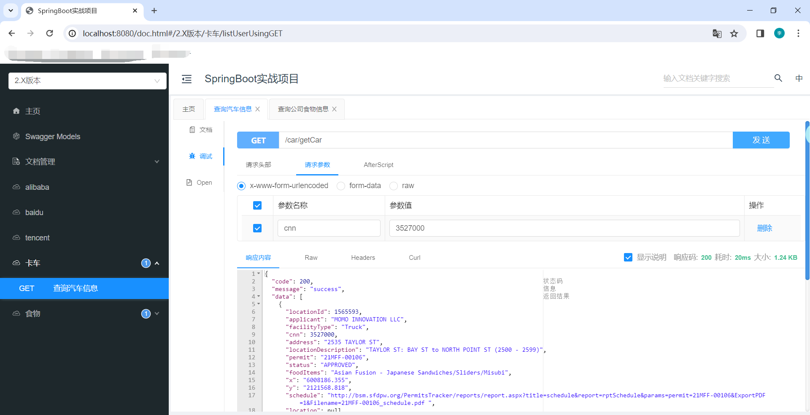
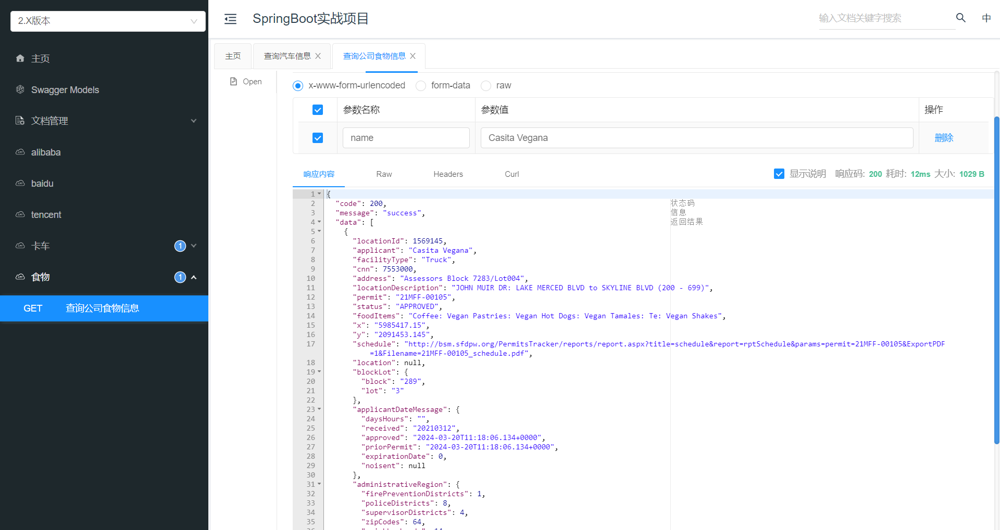

# springboot-demo项目介绍

#### 技术选型
    1、SpringBoot：2.2.5.RELEASE
    2、数据库：Mysql5.7，使用 阿里Druid数据源 的连接池.
    3、ORM框架：Mybatis
    4、使用阿里 EasyExcel 进行Excel文件导入、导出，可参考官网[EasyExcel官网](https://easyexcel.opensource.alibaba.com/docs/current/)
    5、使用  knife4j组件 生成接口文档，进行接口测试。(推荐)
    6、使用 Spring 统一异常处理，处理异常.
    
    
### 简单介绍
    
1、当项目启动后，可以在 http://localhost:8080/doc.html#/home 中查看 Controller层 接口文档，并进行测试；
\

2、CarController接口，查询汽车信息，输入入参：3527000， 查询返回结果如下图所示：

\
3、FoodController接口，查询汽车信息，输入入参：Casita Vegana， 查询返回结果如下图所示：

    
    

### 项目作者
  
  我的邮箱：zhou.ren.cf@foxmail.com ，希望面试能够通过。(^_^)   2024/03/20  19:38

